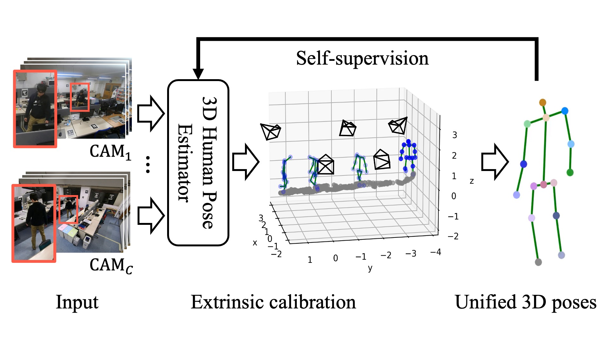

# Extrinsic Camera Calibration From a Moving Person, IROS2022 and RA-L

This repository provides an implementation of our paper [Extrinsic Camera Calibration From a Moving Person](https://ieeexplore.ieee.org/document/9834083) in IROS 2022 and RA-L. If you use our code and/or data please cite our paper.

Please note that this is research software and may contain bugs or other issues – please use it at your own risk. If you experience major problems with it, you may contact us, but please note that we do not have the resources to deal with all issues.

```
@ARTICLE{9834083,
  author={Lee, Sang-Eun and Shibata, Keisuke and Nonaka, Soma and Nobuhara, Shohei and Nishino, Ko},
  journal={IEEE Robotics and Automation Letters},
  title={Extrinsic Camera Calibration From a Moving Person},
  year={2022},
  volume={7},
  number={4},
  pages={10344--10351},
  doi={10.1109/LRA.2022.3192629}}
```



## 1. Prerequisites

### 1.1 Python Packages

We tested our code with Python 3.8.8 on Ubuntu 18.04 LTS. Please browse `conda.yaml` to install packages with the specific versions we used in our experiments.

```
conda env create --file conda.yaml
```

Alternatively, you can use [./singularity/human_calib.def](./singularity/human_calib.def) to build and run the code in a singularity container by

```
sh ./singularity/build.sh
sh ./singularity/run.sh
```

### 1.2 VideoPose3D

Please prepare [VideoPose3D](https://github.com/facebookresearch/VideoPose3D) in `./third_party/VideoPose3D/` directory by

```
git submodule update --init --recursive
```


We tested our code with [this commit](https://github.com/facebookresearch/VideoPose3D/commit/1afb1ca0f1237776518469876342fc8669d3f6a9) and an official pretrained model [`pretrained_h36m_detectron_coco.bin`](https://dl.fbaipublicfiles.com/video-pose-3d/pretrained_h36m_detectron_coco.bin) that takes 2D poses in COCO format as inputs and returns 3D human poses in Human3.6M format.  Please prepare the model in `./model/` directory by

```
mkdir -p ./model
cd ./model
wget https://dl.fbaipublicfiles.com/video-pose-3d/pretrained_h36m_detectron_coco.bin
cd ..
```

 <!-- The model has different pose annotations between the input (COCO) and output (Human3.6M). -->

## 2. Dataset

Please prepare as shown below in `./third_party/` directory.  These files are provided by GAFA, Human3.6M, Panoptic, and SynADL datasets and you need to download each of them by yourself.  Please read `README.md` in each of [`./third_party/GAFA/`](third_party/GAFA/), [`third_party/H36M`](third_party/H36M/), [`third_party/Panoptic`](third_party/Panoptic/), and [`third_party/SynADL`](third_party/SynADL/) for details.
 
We do not modify the files in these dataset directories.  You can make them read-only and/or symlinks to existing files in your local storage.  In what follows, we use `./data/` as a working directory and store files converted into our format.

```
third_party
├── GAFA
│   └── ...
├── H36M
│   ├── ...
│   └── retrain
│       ├── data_2d_h36m_detectron_pt_coco.npz
│       └── data_3d_h36m.npz
├── SynADL
│   ├── Openpose
│   │   ├── 2DJ
│   │   │   ├── A023_P102_G003_C021.json
│   │   │   ├── A023_P102_G003_C023.json
│   │   │   ├── A023_P102_G003_C025.json
│   │   │   └── A023_P102_G003_C027.json
│   │   └── 3DJ
│   │       ├── A023_P102_G003_C021.json
│   │       ├── A023_P102_G003_C023.json
│   │       ├── A023_P102_G003_C025.json
│   │       └── A023_P102_G003_C027.json
│   └── README.md
└── VideoPose3D
    └── ...
```


### 2.1 Synthetic scene

Please follow [`./third_party/SynADL/README.md`](./third_party/SynADL/README.md) and prepare the synthetic data from KIST SynADL dataset. Note that KIST SynADL dataset does not provide the camera parameters. We provide a script to calibrate the cameras from the provided 2D and 3D joints, and use the obtained parameters as the ground truth.

```
sh ./prepare_synadl.sh ./third_party/SynADL 23 102 3 ./data/
```

As written in the paper, this script uses the four cameras 21, 23, 25, and 27 for evaluation, and generates the following files.

```
data
└── A023_P102_G003
    └── gt_subset
        ├── 2d_joint
        │   ├── A023_P102_G003_C021.json
        │   ├── A023_P102_G003_C023.json
        │   ├── A023_P102_G003_C025.json
        │   └── A023_P102_G003_C027.json
        ├── 3d_joint
        │   ├── A023_P102_G003_C021.json
        │   ├── A023_P102_G003_C023.json
        │   ├── A023_P102_G003_C025.json
        │   └── A023_P102_G003_C027.json
        ├── cameras_G003.json
        ├── skeleton_w_G003.json
        └── vis_A023_P102_G003.png
```

`cameras_G003.json` stores the calibration parameters, and `skeleton_w_G003.json` stores the 3D joint positions in the world coordinate system.


We then inject Gaussian noise into the 2D human poses by

```
sh ./add_noise.sh ./data/A023_P102_G003 23 102 3 1 3
```

This copies `data/A023_P102_G003/gt_subset/` as `./data/A023_P102_G003/noise_3_0/` and updates 2D joints with noisy ones.  We generate the corresponding 3D poses for each camera by VideoPose3D as a pretrained 3D human pose estimator:

```
sh ./inference.sh ./data/A023_P102_G003 23 102 3 noise_3_0 pretrained_h36m_detectron_coco.bin SynADL
```

Please notice that KIST SynADL provides OpenPose annotation while VideoPose3D is pretrained with 2D COCO and 3D Human3.6M format. This script converts the format for VideoPose3D.

### 2.2 Real scene

We evaluate our method using three datasets: [GAFA Dataset](https://github.com/kyotovision-public/dynamic-3d-gaze-from-afar), [CMU Panoptic Dataset](http://domedb.perception.cs.cmu.edu/), and [Human3.6M Dataset](http://vision.imar.ro/human3.6m/).  The dataset called `ours` in the paper is a part of Lab sequence in the GAFA dataset. You can find `camera_ids` in [`config/config.yaml`](config/config.yaml).

To run our calibration for these datasets, we need to convert their original files into the above-mentioned structure.  That is, we need
* 2D joints per camera in `./2d_joint`,
* 3D joints per camera in `./3d_joint`,
* the ground truth camera calibration parameters in `cameras_G???.json`, and 
* the ground truth 3D poses in the world coordinate system in `skeleton_w_G???.json`.

To prepare 2D joint positions, we use, in `prepare_{dataset_name}.sh`, [`infer_video_d2.py`](./third_party/VideoPose3D/inference/infer_video_d2.py) and [`prepare_data_2d_custom.py`](./third_party/VideoPose3D/data/prepare_data_2d_custom.py) provided by VideoPose3D.  The 3D joints are prepared by running `inference.sh` as done above.  Please note that we follow the `A???_P???_G???` naming convention by KIST SynADL, and we use `A077_P077_G077` for GAFA, `A088_P088_G088` for Panoptic, and `A099_P099_G099` for Human3.6M in the scripts.

Please read `README.md` of each subdirectories of [`./third_party/`](./third_party/) for details.

* [`third_party/GAFA/README.md`](third_party/GAFA/README.md)
* [`third_party/H36M/README.md`](third_party/H36M/README.md)
* [`third_party/Panoptic/README.md`](third_party/Panoptic/README.md)


## 3. Extrinsic calibration

Run `run_all.sh` to do our alternating camera calibration.  For SynADL dataset, for example, 

```
sh ./run_synadl.sh
```

calls `run_all.sh` to do the calibration for `./data/A023_P102_G003/noise_3_0/`.  The results can be found in `./data/A023_P102_G003/results/`.  In this directory, you have

```
results/
├── 2d_joint
│   ├── gt_subset_A023_P102_G003_C021.mp4  # visualization of GT 2D joint motions
│   ├── gt_subset_A023_P102_G003_C023.mp4
│   ├── gt_subset_A023_P102_G003_C025.mp4
│   ├── gt_subset_A023_P102_G003_C027.mp4
│   ├── noise_3_0_A023_P102_G003_C021.mp4  # visualization of input 2D joint motions
│   ├── noise_3_0_A023_P102_G003_C023.mp4
│   ├── noise_3_0_A023_P102_G003_C025.mp4
│   └── noise_3_0_A023_P102_G003_C027.mp4
├── 3d_joint
│   ├── gt_subset_A023_P102_G003_C021.gif  # visualization of GT 3D joint motions
│   ├── gt_subset_A023_P102_G003_C023.gif
│   ├── gt_subset_A023_P102_G003_C025.gif
│   ├── gt_subset_A023_P102_G003_C027.gif
│   ├── noise_3_0_A023_P102_G003_C021.gif  # visualization of input 3D joint motions
│   ├── noise_3_0_A023_P102_G003_C023.gif
│   ├── noise_3_0_A023_P102_G003_C025.gif
│   └── noise_3_0_A023_P102_G003_C027.gif
├── camera
│   ├── linear_3_0_A023_P102_G003.gif      # visualization of the camera poses and the triangulated 3D joints by the linear calibration
│   └── linear_3_0_ba_A023_P102_G003.gif   # visualization of the camera poses and the triangulated 3D joints by the bundle adjustment
├── eval
│   ├── linear_3_0.json                    # quantitative results
│   ├── linear_3_0_ba.json
│   ├── ransac_3_0.json
│   └── ransac_3_0_ba.json
├── linear_3_0.json                        # estimated camera parameters
├── linear_3_0_ba.json
├── ransac_3_0.json
└── ransac_3_0_ba.json
```

For GAFA, Human3.6M, and Panoptic, use

* `run_gafa.sh`,
* `run_h36m.sh`, and
* `run_panoptic.sh`

respectively.  


## 4. Self-supervised fine-tuning of 3D pose estimator

This section provides instructions on our self-supervised fine-tuning of VideoPose3D using GAFA dataset (and Human3.6M dataset to prevent overfitting).  We assume that you have already prepared the NPZ files specified in  the `data_2d_h36m` and `data_3d_h36m` fields of [`config/config.yaml`](config/config.yaml) as instructed in [`./third_party/H36M/README.md`](./third_party/H36M/README.md).

Also before running the code, please modify the beginning of [`./third_party/VideoPose3D/common/mocap_dataset.py`](./third_party/VideoPose3D/common/mocap_dataset.py) as follows.
```
 import numpy as np
 from common.skeleton import Skeleton
+import copy

 class MocapDataset:
     def __init__(self, fps, skeleton):
-        self._skeleton = skeleton
+        self._skeleton = copy.deepcopy(skeleton)
         self._fps = fps
         self._data = None # Must be filled by subclass
         self._cameras = None # Must be filled by subclass
```

You can run our self-supervised fine-tuning by [`./run_retrain.sh`](./run_retrain.sh).  

```
sh ./run_retrain.sh
```

This calls `retrain.sh` and `retrain_calib.sh` iteratively to do the self-supervised fine-tuning and the re-calibration alternatingly.  The results can be found in `data/GAFA/noise_77_0/results/`. GIF animations in `data/GAFA/noise_77_0/results/3d_pose/` visualize the improvements by the self-supervised fine-tuning.

This script will finish with printing calibration errors after the re-calibration.  Please notice that due to some randomness in re-training VideoPose3D, these values might be slightly different from what you observe.

```
############## Evaluation ##############
GAFA
target=./data/A077_P077_G077/results/linear_77_120.json
       Min  Median  Mean  Max
E_R: 0.0518 0.1001 0.0918 0.1314
E_t: 0.0998 0.1746 0.2185 0.5223
E_p: 0.5254 29.0716 32.2839 218.3994
E_x: 0.0233 0.2310 0.2434 0.9709

GAFA
target=./data/A077_P077_G077/results/linear_77_120_ba.json
       Min  Median  Mean  Max
E_R: 0.0219 0.0257 0.0251 0.0288
E_t: 0.0571 0.0624 0.0822 0.1232
E_p: 0.0221 3.3284 4.0861 25.3383
E_x: 0.0090 0.0543 0.0578 0.2498
```

Just for your reference, you can also download the weights of the fine-tuned model from [here](https://drive.google.com/file/d/1y0gmqs4Qv009KsryBocuXnFUP2P7jpBd/view?usp=sharing).


## License

This software is provided under the [MIT license](LICENSE).

